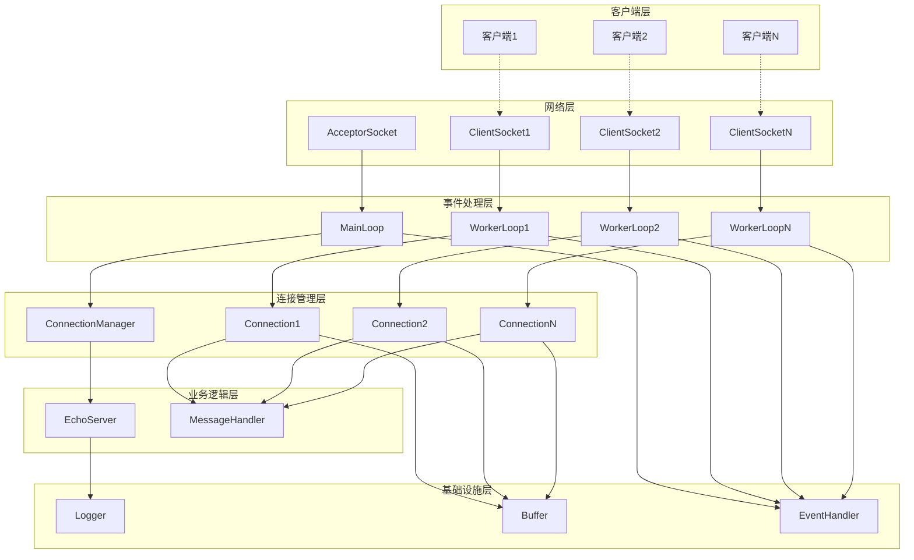
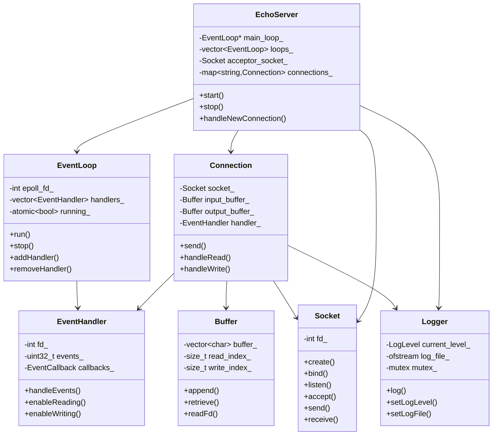

# EchoServer - 高性能C++网络服务器

## 项目简介

EchoServer是一个基于C++17开发的高性能网络服务器，采用现代C++设计模式和最佳实践。服务器实现了经典的Echo功能，将客户端发送的数据原样返回，同时提供了完整的网络编程框架，可以轻松扩展为其他类型的网络服务。

## 核心特性

- **高性能**: 基于epoll的事件驱动架构，支持高并发连接
- **多线程**: 支持多线程工作模式，充分利用多核CPU
- **模块化设计**: 清晰的模块划分，易于维护和扩展
- **线程安全**: 完善的线程安全机制
- **优雅关闭**: 支持信号处理和优雅关闭
- **详细日志**: 多级别日志系统，支持文件和控制台输出
- **现代C++**: 使用C++17特性，RAII、智能指针等

## 系统架构

### 整体架构图



### 模块关系图



## 核心模块详解

### 1. Logger (日志系统)

**功能**: 提供线程安全的多级别日志记录

**主要接口**:
- `setLogLevel(LogLevel level)`: 设置日志级别
- `setLogFile(const string& filename)`: 设置日志文件
- `log(LogLevel level, const string& message)`: 记录日志
- `debug/info/warn/error/fatal(const string& message)`: 便捷日志接口

**特性**:
- 单例模式，全局唯一
- 线程安全，使用互斥锁保护
- 支持控制台和文件输出
- 自动添加时间戳和线程ID

### 2. Socket (套接字封装)

**功能**: 封装TCP套接字操作，提供面向对象的网络编程接口

**主要接口**:
- `create()`: 创建套接字
- `bind(address, port)`: 绑定地址和端口
- `listen(backlog)`: 开始监听
- `accept()`: 接受连接
- `send/receive()`: 数据收发
- `setNonBlocking()`: 设置非阻塞模式

**特性**:
- RAII管理，自动关闭文件描述符
- 支持移动语义，避免不必要的拷贝
- 完善的错误处理和日志记录

### 3. Buffer (缓冲区)

**功能**: 高效的动态缓冲区，优化网络I/O性能

**主要接口**:
- `append(data, len)`: 追加数据
- `retrieve(len)`: 读取数据
- `readFd(fd)`: 从文件描述符读取
- `findCRLF/findEOL()`: 查找分隔符

**特性**:
- 基于vector实现，自动扩容
- 预留空间设计，减少内存分配
- 支持scatter-gather I/O
- 提供便捷的字符串操作接口

### 4. EventLoop (事件循环)

**功能**: 基于epoll的事件循环，实现高性能I/O多路复用

**主要接口**:
- `run()`: 启动事件循环
- `stop()`: 停止事件循环
- `addHandler/updateHandler/removeHandler()`: 管理事件处理器
- `runInLoop()`: 在事件循环中执行任务

**特性**:
- 基于epoll实现，支持边缘触发
- 线程安全的任务队列
- 支持跨线程操作
- 优雅的唤醒机制

### 5. EventHandler (事件处理器)

**功能**: 封装文件描述符和相关的事件回调函数

**主要接口**:
- `setReadCallback/setWriteCallback()`: 设置回调函数
- `enableReading/enableWriting()`: 启用事件
- `handleEvents()`: 处理事件

**特性**:
- 回调函数机制，解耦事件和处理逻辑
- 支持多种事件类型
- 灵活的事件控制

### 6. Connection (连接管理)

**功能**: 管理单个TCP连接的生命周期和数据传输

**主要接口**:
- `send(data)`: 发送数据
- `shutdown()`: 优雅关闭
- `setMessageCallback()`: 设置消息回调
- `establishConnection/destroyConnection()`: 连接管理

**特性**:
- 完整的连接状态管理
- 异步数据发送，支持大数据量
- 优雅关闭机制
- 丰富的回调接口

### 7. EchoServer (服务器主类)

**功能**: 服务器的核心控制类，协调各个模块工作

**主要接口**:
- `start()`: 启动服务器
- `stop()`: 停止服务器
- `setThreadNum()`: 设置线程数
- `setMessageCallback()`: 设置消息处理回调

**特性**:
- 多线程架构，主线程负责接受连接，工作线程处理I/O
- 负载均衡，连接分配到不同的工作线程
- 优雅关闭，等待所有连接处理完成
- 灵活的回调机制，易于扩展

## 编译和运行

### 系统要求

- Linux操作系统
- GCC 7.0+ 或 Clang 5.0+ (支持C++17)
- CMake 3.16+

### 编译步骤

```bash
# 克隆或下载项目
cd EchoServer

# 创建构建目录
mkdir build && cd build

# 配置和编译
cmake ..
make -j$(nproc)

# 编译测试客户端
g++ -std=c++17 -o client ../examples/client.cpp
```

### 运行服务器

```bash
# 使用默认配置运行
./bin/echo_server

# 指定端口和线程数
./bin/echo_server -p 9999 -t 4

# 启用调试日志并输出到文件
./bin/echo_server -l DEBUG -f server.log

# 查看所有选项
./bin/echo_server --help
```

### 测试客户端

```bash
# 交互模式
./client -s 127.0.0.1 -p 8080

# 性能测试模式
./client -b 1000

# 连接到远程服务器
./client -s 192.168.1.100 -p 9999
```

## 性能特性

### 并发模型

- **Reactor模式**: 基于事件驱动的非阻塞I/O
- **多线程**: 主线程接受连接，工作线程处理I/O
- **负载均衡**: Round-robin方式分配连接到工作线程

### 内存管理

- **智能指针**: 使用shared_ptr和unique_ptr管理资源
- **RAII**: 资源获取即初始化，自动释放资源
- **缓冲区优化**: 预分配缓冲区，减少内存分配次数

### 网络优化

- **TCP_NODELAY**: 禁用Nagle算法，降低延迟
- **SO_REUSEADDR**: 允许地址重用
- **非阻塞I/O**: 避免线程阻塞
- **边缘触发**: epoll边缘触发模式，提高效率

## 扩展指南

### 添加新的协议支持

1. 继承或修改`Connection`类
2. 实现协议特定的消息解析逻辑
3. 在`EchoServer`中设置相应的消息回调

### 添加新的业务逻辑

1. 实现自定义的消息处理函数
2. 通过`setMessageCallback`设置到服务器
3. 可以访问连接信息和缓冲区数据

### 性能调优

1. 调整工作线程数量（通常等于CPU核心数）
2. 优化缓冲区大小
3. 根据业务需求调整epoll参数
4. 使用性能分析工具（如perf、valgrind）

## 故障排除

### 常见问题

1. **端口被占用**: 使用`netstat -tlnp | grep 端口号`检查
2. **权限不足**: 确保有绑定端口的权限（1024以下端口需要root权限）
3. **连接被拒绝**: 检查防火墙设置和服务器状态
4. **性能问题**: 检查系统资源使用情况，调整线程数

### 调试技巧

1. 启用DEBUG日志级别查看详细信息
2. 使用gdb调试器分析崩溃问题
3. 使用strace跟踪系统调用
4. 监控系统资源使用情况

## 许可证

本项目采用MIT许可证，详见LICENSE文件。

## 贡献指南

欢迎提交Issue和Pull Request来改进项目。请确保：

1. 代码符合项目的编码规范
2. 添加适当的测试用例
3. 更新相关文档
4. 提交前进行充分测试

## 联系方式

如有问题或建议，请通过以下方式联系：

- 提交GitHub Issue
- 发送邮件到项目维护者

---

**注意**: 本项目仅用于学习和演示目的，生产环境使用前请进行充分的测试和安全评估。