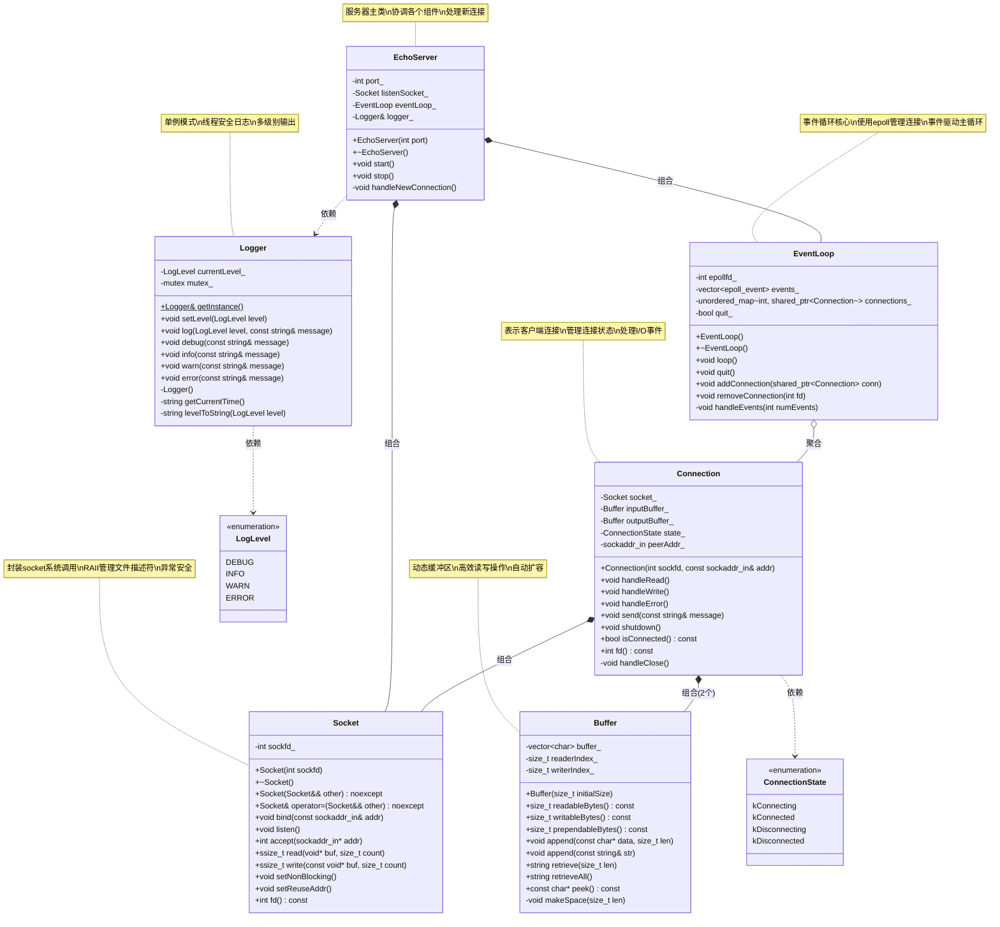

# EchoServer项目完整学习指南

## 🎯 项目概述

欢迎来到EchoServer项目！这是一个专为C++新手设计的网络编程学习项目。通过构建一个完整的Echo服务器，你将学会：

- 网络编程基础概念
- 面向对象设计原则
- 事件驱动编程模式
- C++项目组织和构建
- 调试和测试技巧

**项目目标**：实现一个高性能的Echo服务器，能够同时处理多个客户端连接，接收消息并原样返回。

## 📚 第一阶段：理论基础

### 1.1 网络编程基础概念

在开始编码之前，我们需要理解几个核心概念：

**TCP/IP协议**
- TCP是面向连接的可靠协议
- 客户端-服务器模型
- 三次握手建立连接

**Socket编程**
```
服务器端流程：
1. socket() - 创建套接字
2. bind() - 绑定地址和端口
3. listen() - 监听连接请求
4. accept() - 接受客户端连接
5. read()/write() - 数据传输
6. close() - 关闭连接

客户端流程：
1. socket() - 创建套接字
2. connect() - 连接服务器
3. write()/read() - 数据传输
4. close() - 关闭连接
```

**I/O多路复用**
- 使用epoll管理多个连接
- 事件驱动编程模式
- 非阻塞I/O操作

### 1.2 学习资源
- 推荐阅读：《Unix网络编程》第一卷
- 在线资源：Linux man pages (man 2 socket)

## 🏗️ 第二阶段：架构设计

### 2.1 需求分析

**功能需求**：
1. 接受多个客户端连接
2. 接收客户端消息
3. 将消息原样返回给客户端
4. 支持并发处理
5. 提供日志记录
6. 优雅关闭服务器

**非功能需求**：
1. 高性能（支持1000+并发连接）
2. 低延迟
3. 内存安全
4. 易于维护和扩展

### 2.2 UML类图设计



### 2.3 类职责分析

**Logger类**：
- 职责：提供统一的日志记录接口
- 特点：无依赖，线程安全
- 优先级：最高（其他类都可能用到）

**Buffer类**：
- 职责：管理数据缓冲区，提供高效的读写操作
- 特点：自动扩容，支持批量操作
- 优先级：高（Connection类依赖）

**Socket类**：
- 职责：封装底层socket系统调用
- 特点：RAII管理，异常安全
- 优先级：高（Connection类依赖）

**Connection类**：
- 职责：表示一个客户端连接，处理该连接的所有I/O操作
- 特点：状态管理，事件驱动
- 优先级：中（依赖Socket和Buffer）

**EventLoop类**：
- 职责：事件循环核心，使用epoll管理多个连接
- 特点：高性能，支持大量并发连接
- 优先级：中（依赖Connection）

**EchoServer类**：
- 职责：服务器主类，协调各个组件
- 特点：简单的接口，隐藏复杂性
- 优先级：最低（依赖所有其他类）

## 🔧 第三阶段：基础组件实现

### 3.1 Logger类实现

**设计思路**：
- 支持不同日志级别（DEBUG, INFO, WARN, ERROR）
- 线程安全
- 格式化输出（时间戳 + 级别 + 消息）

**实现步骤**：

1. **创建头文件** (`include/logger.h`)：
```cpp
#pragma once
#include <string>
#include <fstream>
#include <mutex>

enum class LogLevel {
    DEBUG = 0,
    INFO = 1,
    WARN = 2,
    ERROR = 3
};

class Logger {
public:
    static Logger& getInstance();
    void setLevel(LogLevel level);
    void log(LogLevel level, const std::string& message);
    void debug(const std::string& message);
    void info(const std::string& message);
    void warn(const std::string& message);
    void error(const std::string& message);

private:
    Logger() = default;
    std::string getCurrentTime();
    std::string levelToString(LogLevel level);
    
    LogLevel currentLevel_ = LogLevel::INFO;
    std::mutex mutex_;
};
```

2. **实现源文件** (`src/logger.cpp`)：
```cpp
#include "logger.h"
#include <iostream>
#include <chrono>
#include <iomanip>
#include <sstream>

Logger& Logger::getInstance() {
    static Logger instance;
    return instance;
}

void Logger::setLevel(LogLevel level) {
    std::lock_guard<std::mutex> lock(mutex_);
    currentLevel_ = level;
}

void Logger::log(LogLevel level, const std::string& message) {
    if (level < currentLevel_) return;
    
    std::lock_guard<std::mutex> lock(mutex_);
    std::cout << getCurrentTime() << " [" << levelToString(level) << "] " 
              << message << std::endl;
}

// ... 其他方法实现
```

**测试验证**：
```cpp
// 简单测试
int main() {
    auto& logger = Logger::getInstance();
    logger.debug("这是调试信息");
    logger.info("服务器启动");
    logger.warn("这是警告");
    logger.error("这是错误");
    return 0;
}
```

### 3.2 Buffer类实现

**设计思路**：
- 动态扩容的字节数组
- 支持高效的读写操作
- 内存安全，避免缓冲区溢出

**核心数据结构**：
```
┌─────────────────────────────────────────┐
│  prependable  │   readable   │ writable │
│               │              │          │
└─────────────────────────────────────────┘
0      <=   readerIndex  <=  writerIndex  <= size
```

**实现步骤**：

1. **头文件设计**：
```cpp
class Buffer {
public:
    static const size_t kCheapPrepend = 8;
    static const size_t kInitialSize = 1024;
    
    explicit Buffer(size_t initialSize = kInitialSize);
    
    size_t readableBytes() const;
    size_t writableBytes() const;
    size_t prependableBytes() const;
    
    void append(const char* data, size_t len);
    void append(const std::string& str);
    
    std::string retrieve(size_t len);
    std::string retrieveAll();
    
    const char* peek() const;
    
private:
    void makeSpace(size_t len);
    
    std::vector<char> buffer_;
    size_t readerIndex_;
    size_t writerIndex_;
};
```

**学习要点**：
- 理解缓冲区的读写指针概念
- 掌握动态内存管理
- 学会设计高效的数据结构

### 3.3 Socket类实现

**设计思路**：
- RAII管理socket文件描述符
- 封装常用的socket操作
- 提供异常安全保证

**实现要点**：
```cpp
class Socket {
public:
    explicit Socket(int sockfd);
    ~Socket();
    
    // 禁止拷贝，允许移动
    Socket(const Socket&) = delete;
    Socket& operator=(const Socket&) = delete;
    Socket(Socket&& other) noexcept;
    Socket& operator=(Socket&& other) noexcept;
    
    void bind(const struct sockaddr_in& addr);
    void listen();
    int accept(struct sockaddr_in* addr);
    
    ssize_t read(void* buf, size_t count);
    ssize_t write(const void* buf, size_t count);
    
    void setNonBlocking();
    void setReuseAddr();
    
    int fd() const { return sockfd_; }
    
private:
    int sockfd_;
};
```

**学习要点**：
- 理解RAII原则
- 掌握移动语义
- 学会错误处理

## ⚙️ 第四阶段：核心组件实现

### 4.1 Connection类实现

**设计思路**：
- 表示一个客户端连接
- 管理连接的状态和数据
- 处理读写事件

**状态管理**：
```cpp
enum class ConnectionState {
    kConnecting,
    kConnected,
    kDisconnecting,
    kDisconnected
};
```

**核心方法**：
```cpp
class Connection {
public:
    Connection(int sockfd, const struct sockaddr_in& addr);
    
    void handleRead();
    void handleWrite();
    void handleError();
    
    void send(const std::string& message);
    void shutdown();
    
    bool isConnected() const;
    int fd() const;
    
private:
    void handleClose();
    
    Socket socket_;
    Buffer inputBuffer_;
    Buffer outputBuffer_;
    ConnectionState state_;
    struct sockaddr_in peerAddr_;
};
```

### 4.2 EventLoop类实现

**设计思路**：
- 使用epoll实现I/O多路复用
- 管理所有活跃连接
- 事件驱动的主循环

**核心结构**：
```cpp
class EventLoop {
public:
    EventLoop();
    ~EventLoop();
    
    void loop();
    void quit();
    
    void addConnection(std::shared_ptr<Connection> conn);
    void removeConnection(int fd);
    
private:
    void handleEvents(int numEvents);
    
    int epollfd_;
    std::vector<struct epoll_event> events_;
    std::unordered_map<int, std::shared_ptr<Connection>> connections_;
    bool quit_;
};
```

**学习要点**：
- 理解epoll的工作原理
- 掌握事件驱动编程
- 学会管理对象生命周期

## 🚀 第五阶段：服务器主体实现

### 5.1 EchoServer类实现

**设计思路**：
- 协调各个组件
- 处理新连接
- 提供简单的启动/停止接口

```cpp
class EchoServer {
public:
    EchoServer(int port);
    ~EchoServer();
    
    void start();
    void stop();
    
private:
    void handleNewConnection();
    
    int port_;
    Socket listenSocket_;
    EventLoop eventLoop_;
    Logger& logger_;
};
```

### 5.2 主函数实现

```cpp
int main(int argc, char* argv[]) {
    try {
        int port = (argc > 1) ? std::atoi(argv[1]) : 8080;
        
        EchoServer server(port);
        
        // 设置信号处理
        signal(SIGINT, [](int) {
            // 优雅关闭
        });
        
        server.start();
    }
    catch (const std::exception& e) {
        std::cerr << "错误: " << e.what() << std::endl;
        return 1;
    }
    
    return 0;
}
```

## 🧪 第六阶段：测试和调试

### 6.1 单元测试

为每个类编写单元测试：

```cpp
// 测试Buffer类
void testBuffer() {
    Buffer buf;
    
    // 测试写入
    buf.append("Hello");
    assert(buf.readableBytes() == 5);
    
    // 测试读取
    std::string data = buf.retrieve(5);
    assert(data == "Hello");
    assert(buf.readableBytes() == 0);
}
```

### 6.2 集成测试

编写客户端程序测试服务器：

```cpp
// 简单的测试客户端
int main() {
    int sockfd = socket(AF_INET, SOCK_STREAM, 0);
    
    struct sockaddr_in addr;
    addr.sin_family = AF_INET;
    addr.sin_port = htons(8080);
    inet_pton(AF_INET, "127.0.0.1", &addr.sin_addr);
    
    connect(sockfd, (struct sockaddr*)&addr, sizeof(addr));
    
    std::string message = "Hello, Server!";
    send(sockfd, message.c_str(), message.length(), 0);
    
    char buffer[1024];
    ssize_t n = recv(sockfd, buffer, sizeof(buffer), 0);
    buffer[n] = '\0';
    
    std::cout << "收到回复: " << buffer << std::endl;
    
    close(sockfd);
    return 0;
}
```

### 6.3 调试技巧

**使用GDB调试**：
```bash
# 编译调试版本
g++ -g -O0 -o echo_server src/*.cpp

# 启动GDB
gdb ./echo_server

# 设置断点
(gdb) break EchoServer::handleNewConnection
(gdb) run
```

**日志调试**：
```cpp
void Connection::handleRead() {
    logger_.debug("开始处理读事件, fd=" + std::to_string(socket_.fd()));
    
    ssize_t n = socket_.read(buffer, sizeof(buffer));
    logger_.debug("读取了 " + std::to_string(n) + " 字节");
    
    // ... 处理逻辑
}
```

## 🔍 常见问题和解决方案

### 7.1 编译错误

**问题**：找不到头文件
```
fatal error: 'sys/epoll.h' file not found
```

**解决**：确保在Linux环境下编译，或使用跨平台的替代方案。

### 7.2 运行时错误

**问题**：Address already in use
```
bind: Address already in use
```

**解决**：
```cpp
void Socket::setReuseAddr() {
    int optval = 1;
    setsockopt(sockfd_, SOL_SOCKET, SO_REUSEADDR, &optval, sizeof(optval));
}
```

### 7.3 内存泄漏

**问题**：连接对象没有正确释放

**解决**：使用智能指针管理对象生命周期：
```cpp
std::shared_ptr<Connection> conn = std::make_shared<Connection>(sockfd, addr);
```

### 7.4 性能问题

**问题**：高并发下性能下降

**解决方案**：
1. 使用对象池减少内存分配
2. 优化缓冲区大小
3. 使用更高效的数据结构

## 📈 进阶学习建议

### 8.1 功能扩展

1. **支持HTTP协议**：
   - 解析HTTP请求
   - 生成HTTP响应
   - 支持静态文件服务

2. **添加线程池**：
   - 处理CPU密集型任务
   - 避免阻塞事件循环

3. **实现负载均衡**：
   - 多进程架构
   - 连接分发策略

### 8.2 性能优化

1. **零拷贝技术**：
   - 使用sendfile系统调用
   - 减少数据拷贝次数

2. **内存池**：
   - 预分配内存块
   - 减少malloc/free调用

3. **协议优化**：
   - 二进制协议
   - 压缩算法

### 8.3 学习资源

**书籍推荐**：
- 《Linux高性能服务器编程》
- 《C++并发编程实战》
- 《Effective C++》

**开源项目**：
- muduo网络库
- libevent
- nginx源码

## 🎉 总结

通过完成这个EchoServer项目，你将掌握：

✅ **网络编程基础**：TCP/IP、Socket编程、I/O多路复用

✅ **C++高级特性**：RAII、智能指针、移动语义、异常处理

✅ **软件设计原则**：单一职责、开闭原则、依赖注入

✅ **系统编程技能**：Linux系统调用、多进程/多线程、性能优化

✅ **工程实践**：项目组织、构建系统、测试、调试

**下一步建议**：
1. 完成基础版本的实现
2. 添加更多功能和优化
3. 学习其他网络库的设计
4. 尝试实现更复杂的服务器应用

记住：编程是一个实践的过程，不要害怕犯错，每个错误都是学习的机会！

---

*祝你编程愉快！如果遇到问题，记得查看日志、使用调试器，或者寻求帮助。* 🚀