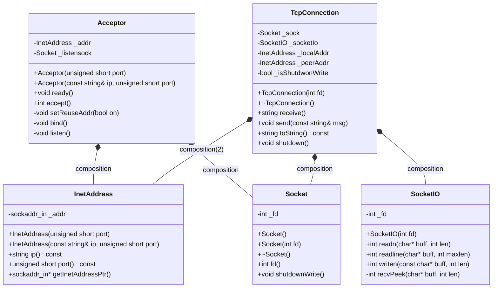
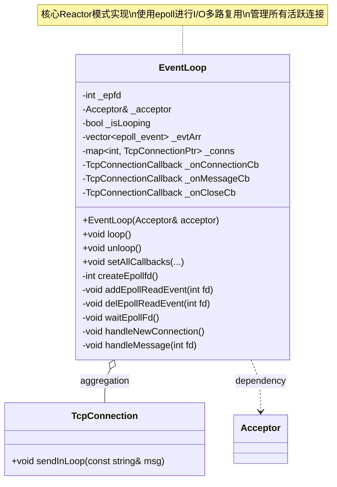
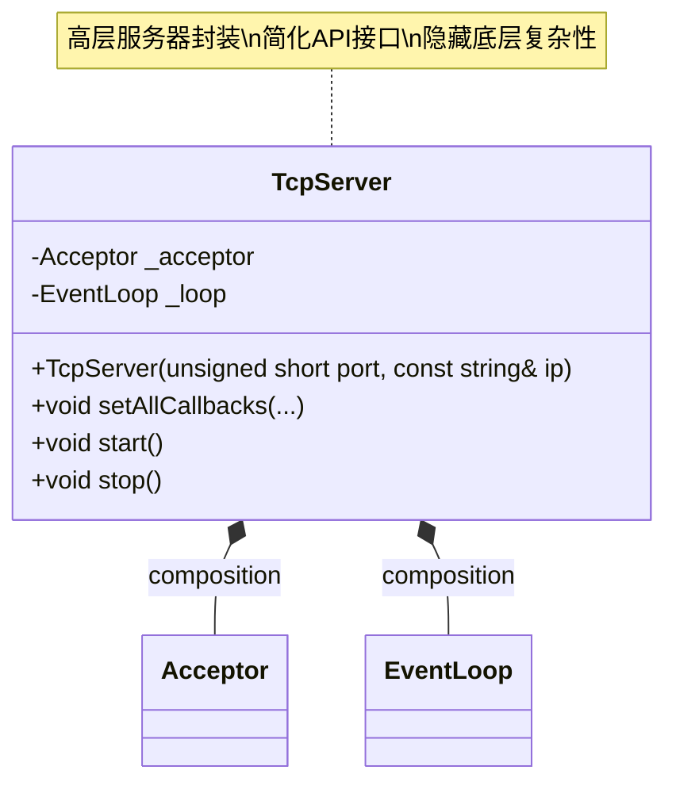
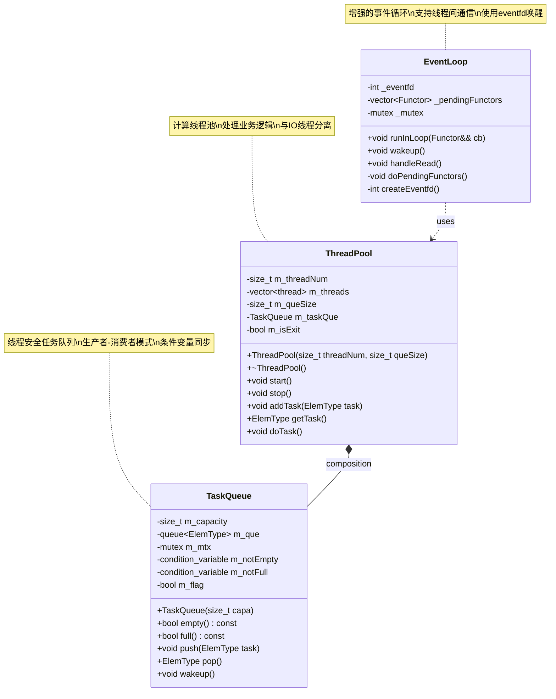

# wd_reactor_server 架构分析报告

## 📊 项目概述

本报告分析了 `wd_reactor_server` 项目中四个版本（v1-v4）的架构演进，展示了从基础网络编程到完整Reactor模式的实现过程。

## 📈 代码量统计

| 版本 | 总代码行数 | 主要组件 | 新增功能 |
|------|-----------|----------|----------|
| Reactor_v1 | 527行 | Socket, Acceptor, TcpConnection | 基础网络连接 |
| Reactor_v2 | 828行 | +EventLoop | 事件循环机制 |
| Reactor_v3 | 886行 | +TcpServer | 服务器封装 |
| Reactor_v4 | 1338行 | +ThreadPool, TaskQueue | 多线程支持 |

**代码增长趋势**：
- v1→v2：增长57% (301行)，引入核心Reactor模式
- v2→v3：增长7% (58行)，添加高层封装
- v3→v4：增长51% (452行)，引入线程池架构

## 🏗️ 架构演进分析

### Reactor_v1：基础网络层

**核心组件**：
- `Socket`：封装socket文件描述符，RAII管理
- `InetAddress`：网络地址封装
- `SocketIO`：提供读写操作接口
- `Acceptor`：监听和接受连接
- `TcpConnection`：管理单个TCP连接

**架构特点**：
- 同步阻塞模式
- 一次只能处理一个连接
- 简单的客户端-服务器模型

### Reactor_v2：引入事件循环

**新增组件**：
- `EventLoop`：事件循环核心，使用epoll实现I/O多路复用

**架构改进**：
- 实现了标准的Reactor模式
- 支持多连接并发处理
- 事件驱动的异步处理
- 回调函数机制（onConnection, onMessage, onClose）

**关键设计**：
```cpp
class EventLoop {
    int _epfd;                              // epoll文件描述符
    map<int, TcpConnectionPtr> _conns;      // 连接管理
    TcpConnectionCallback _onConnectionCb;   // 连接回调
    TcpConnectionCallback _onMessageCb;      // 消息回调
    TcpConnectionCallback _onCloseCb;        // 关闭回调
};
```

### Reactor_v3：服务器封装

**新增组件**：
- `TcpServer`：高层服务器接口

**架构优化**：
- 提供了更简洁的API接口
- 隐藏了底层复杂性
- 更好的模块化设计

**使用简化**：
```cpp
TcpServer server(8000);
server.setAllCallbacks(onConnection, onMessage, onClose);
server.start();
```

### Reactor_v4：多线程架构

**新增组件**：
- `ThreadPool`：线程池管理
- `TaskQueue`：任务队列，线程安全

**架构升级**：
- 引入了计算线程池
- 实现了IO线程与计算线程的分离
- 支持高并发处理
- 线程间通信机制（eventfd）

**关键改进**：
- IO线程专门处理网络事件
- 计算线程处理业务逻辑
- 通过任务队列解耦
- 使用eventfd实现线程间通知

## 🎯 UML类图设计

### Reactor_v1 类图



### Reactor_v2 类图



### Reactor_v3 类图



### Reactor_v4 类图



## 🔄 模块调用关系

### v1版本调用流程
```
TestAcceptor → Acceptor → Socket
             ↓
         TcpConnection → SocketIO
                      → InetAddress
```

### v2版本调用流程
```
TestEventLoop → EventLoop → Acceptor → Socket
                         ↓
                    TcpConnection → SocketIO
                                 → InetAddress
```

### v3版本调用流程
```
TestTcpServer → TcpServer → EventLoop → Acceptor → Socket
                         ↓           ↓
                    Callbacks    TcpConnection
```

### v4版本调用流程
```
TestTcpServer → TcpServer → EventLoop → Acceptor → Socket
                         ↓           ↓
                    ThreadPool   TcpConnection
                         ↓
                    TaskQueue
```

## 📋 版本对比总结

### 功能演进

| 特性 | v1 | v2 | v3 | v4 |
|------|----|----|----|----||
| 基础网络功能 | ✅ | ✅ | ✅ | ✅ |
| 多连接支持 | ❌ | ✅ | ✅ | ✅ |
| 事件驱动 | ❌ | ✅ | ✅ | ✅ |
| 高层封装 | ❌ | ❌ | ✅ | ✅ |
| 多线程支持 | ❌ | ❌ | ❌ | ✅ |
| 线程池 | ❌ | ❌ | ❌ | ✅ |

### 设计模式应用

- **v1**: 基础面向对象设计，RAII模式
- **v2**: Reactor模式，观察者模式（回调）
- **v3**: 外观模式（TcpServer封装）
- **v4**: 生产者-消费者模式，线程池模式

### 性能特点

- **v1**: 同步阻塞，单连接，性能有限
- **v2**: 异步非阻塞，多连接，显著提升
- **v3**: 性能与v2相当，但接口更友好
- **v4**: 支持高并发，CPU密集型任务优化

## 🎯 学习价值

这四个版本完美展示了：

1. **渐进式设计**：从简单到复杂的演进过程
2. **模式应用**：经典设计模式的实际运用
3. **性能优化**：从单线程到多线程的性能提升
4. **架构演进**：软件架构的逐步完善过程

每个版本都有其存在的价值，适合不同的学习阶段和应用场景。通过对比学习，可以深入理解网络编程和系统设计的核心思想。